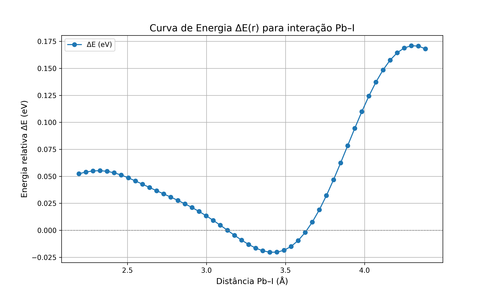

# Treinamento realizado apenas com dados de energia total e geometrias

Este treinamento foi realizado com os dados disponíveis no repositório [https://github.com/salrodgom/FLAMA](https://github.com/salrodgom/FLAMA). Esse repositório contém arquivos com diferentes geometrias de uma mesma substância e um arquivo que informa a energia total de cada estrutura.

O SchNet não trabalha diretamente com o formato dos dados disponibilizados, por isso é necessário realizar um pré-processamento. O script `create_schnet_db.py` trata esses dados, relacionando cada estrutura com sua energia total e criando um banco de dados compatível com o SchNet. Esse processo precisa ser adaptado conforme o tipo e o formato dos arquivos disponíveis.

Com o banco de dados pronto, o script `Script2-PrepDb.py` prepara os dados para o treinamento. Ele separa os dados em conjuntos de treino, validação e teste. Também define o raio de corte (cutoff), que determina os vizinhos considerados no modelo, além de definir as unidades de energia e distância. Um arquivo chamado `split.npz` é gerado e será utilizado durante o treinamento.

O script `Script3-Trein.py` executa o treinamento propriamente dito. Nele, o raio de corte é novamente especificado, e ao final obtém-se uma pasta (por exemplo, `treino_10Ang`), onde o valor no nome representa o cutoff usado no treinamento da rede.

Dentro das pastas de saída do treinamento, encontramos alguns arquivos resultantes, incluindo o melhor modelo obtido.

A pasta `energy_otm` contém um código que realiza a seguinte sequência de passos:

1. Escolhe uma estrutura conhecida.
2. Seleciona um par de átomos (por exemplo, Pb–I) a partir de uma lista definida no próprio código.
3. Altera a distância entre esse par de átomos.
4. Usa o melhor modelo treinado para calcular a nova energia da estrutura modificada.
5. Compara essa nova energia com a energia da estrutura original (sem modificação).
6. Atribui a diferença de energia à interação entre o par de átomos escolhido, já que o restante da estrutura é mantido fixo.
7. Repete esse processo para várias distâncias e gera um arquivo contendo a energia em função da distância.

Na pasta referente ao modelo treinado com cutoff de 5 Å, foram realizadas análises de energias utilizando cutoff de 5 Å e 10 Å para fins comparativos.

O resultado final é uma curva de interação, como a seguinte:

